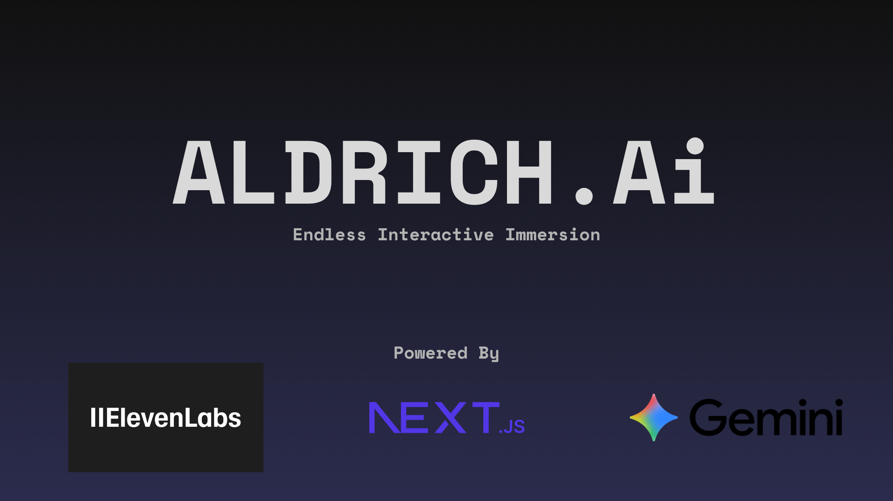

# 🧠 Aldrich.AI  

## 🚀 Overview

**Aldrich.AI** is an experimental, story-driven web app where players embark on an evolving adventure — guided by voice narration.  
Choose your genre, describe your hero, and shape your destiny as AI narrates your story in real time.

This project blends **Next.js**, **AI storytelling by Gemini**, and **ElevenLabs voice synthesis** to create an immersive interactive fiction experience.

---

## ✨ Features

- 🎙️ **Voice Narration** – AI reads your story aloud using **ElevenLabs Voice AI**.  
- 🧭 **Interactive Storytelling** – Choose your path and shape the narrative as you go.  
- 🎭 **Dynamic Prompts** – Each user input influences the story direction and tone.  

---

## 🏗️ Tech Stack

| Layer | Technology |
|-------|-------------|
| **Frontend** | [Next.js 14+](https://nextjs.org), React, TypeScript |
| **Backend** | [.NET9](https://dotnet.microsoft.com/en-us/download/dotnet/9.0), C# |
| **Voice AI** | [ElevenLabs TTS API](https://elevenlabs.io) |
| **Story Generation** | [Gemeni 2.5 Flash](https://gemini.google.com) |

